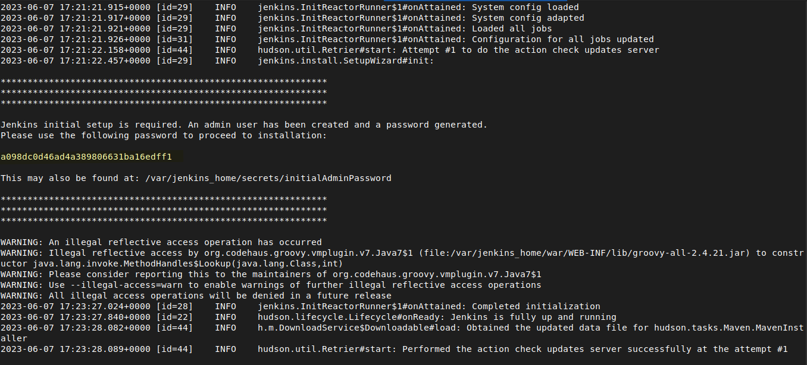

# Instalación de Jenkins#

## Instalación Standard
Para instalar Jenkins en un contenedor de Docker necesitaremos ejecutar los comandos en consola:

```sh 
docker run -p 8080:8080 -p 50000:50000 -v jenkins_home:/var/jenkins_home jenkins/jenkins:lts-jdk11 
```

## Instalación Personalizada
Lo recomendable es utilizar el dockerfile y construir la imágen para posteriormente crear el contenedor, ya que para las pruebas de angular necesitaremos una instalación de Chrome y con el dockerfile solucionamos el problema, los comandos son:
```sh
docker build -t jenkins-chrome .
```
## Otros Ajustes Necesarios
Debes agregar el usuario al grupo de docker con el siguiente comando: 
```sh 
sudo usermod -aG docker {user} 
```
Para que los cambios surtan efecto ejecutar el siguiente comando:  
```sh 
newgrp docker
```

## Ejecución y primeros Pasos
El primer inicio se ejecuta con la siguiente sentencia para que nos muestre el password de Jenkins
```sh 
docker run -u root -p 8080:8080 -p 50000:50000 -v jenkins_home:/var/jenkins_home -v /var/run/docker.sock:/var/run/docker.sock --restart unless-stopped jenkins-chrome:latest
```
Esperar a que inicie el contenedor y muestre la contraseña de Jenkins
<p align="center">
  
</p>

Abrir el navegador, introducir la ruta indicando el puerto configurado, en este caso es:
```sh 
http://localhost:8080
```
Introducir el código 

$ docker run -u root -p 8080:8080 -p 50000:50000 -v jenkins_home:/var/jenkins_home -v /var/run/docker.sock:/var/run/docker.sock -d --restart unless-stopped jenkins-chrome:latest


<p align="center">
22
  
23
</p>

